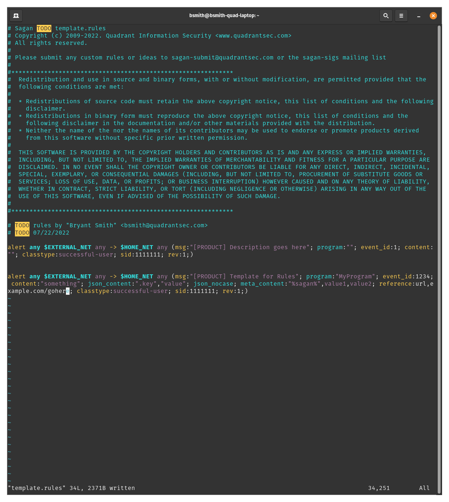

# VIM File for Sagan
### This adds to the hog.vim file already being used by Snort and Suricata

`git clone gogs@gogs.qsecure.net:bsmith/vim.git`

`mkdir -p ~/.vim/after/syntax/`

`cp ./vim/hog.vim ~/.vim/after/syntax/`

